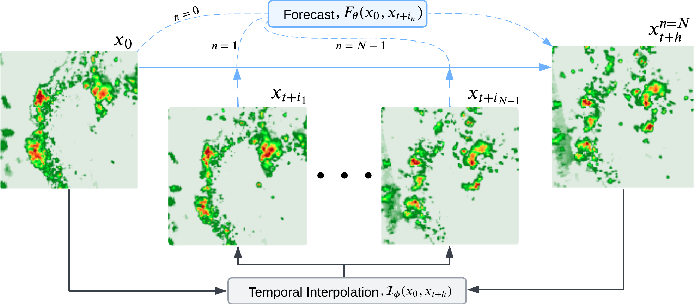
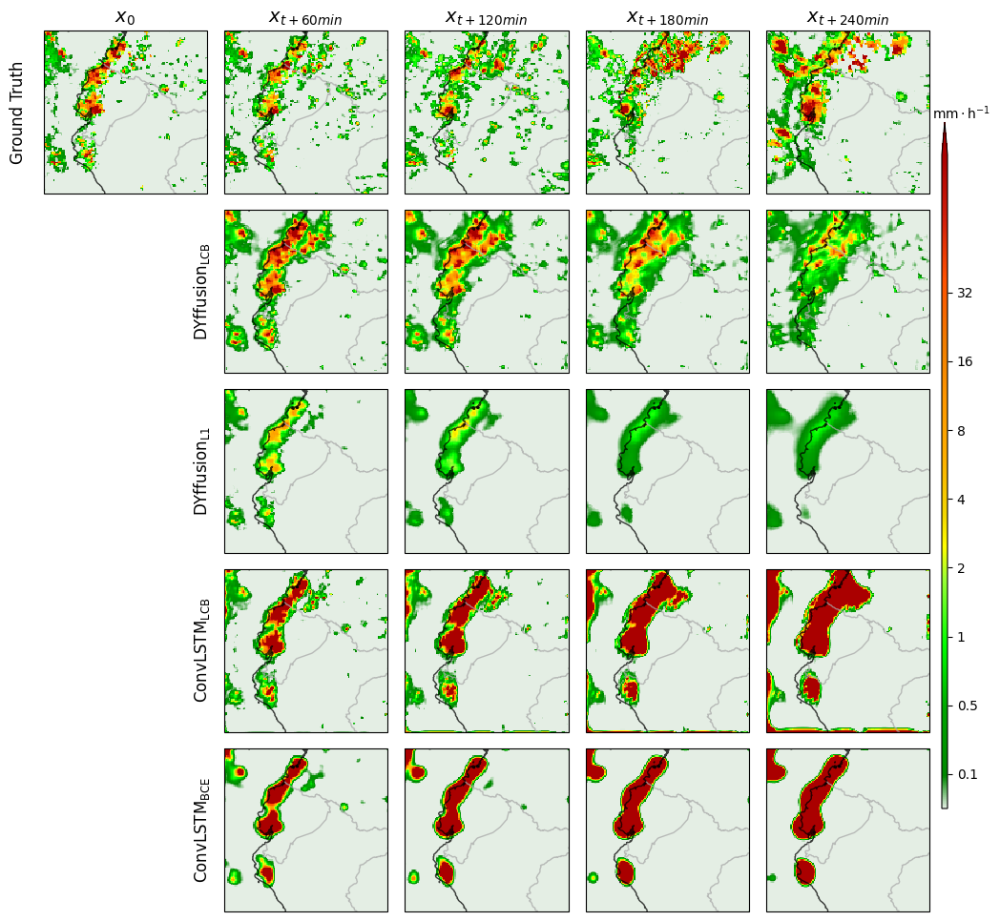

# 🌧️ DYffCast: Regional Scale Precipitation Nowcasting Using IMERG Satellite Data

<div style="text-align: center;">
  
  <p><em>DYffusion forecasts a sequence of <i>h</i> snapshots <i>x<sub>t+i<sub>1</sub></sub> , x<sub>t+i<sub>2</sub></sub> , ... , x<sub>t+h</sub></i> given the initial condition <i>x<sub>0</sub></i>. This is analogous to how standard diffusion models are used to sample from a distribution.</em></p>
</div>

This work extends the probabilistic spatio-temporal forecasting framework, **DYffusion** (from [Rose-STL-Lab/dyffusion](https://github.com/Rose-STL-Lab/dyffusion/tree/main)) to the task of precipitation nowcasting. The aim of this study was to forecast IMERG satellite precipitation data up to a 4-hour horizon. In particular, this work focuses on Colombia, Ecuador, and Perú — countries more susceptible to increased flooding due to climate change and lacking freely available ground-based weather radar data. Additionally, a novel loss function, referred to as LCB, was introduced, combining MSE, MAE, and the LPIPS perceptual score. DYffusion trained with LCB (DYffusion<sub>LCB</sub>), outperformed three competitor models: two ConvLSTM baselines trained with LCB and binary cross-entropy (BCE) loss respecitvely and, a DYffusion model trained with its native L1 loss. The models were also evaluated on the heavy rain event, Cyclone Yaku. DYffusion<sub>LCB</sub> was able to capture the small and large scale features, generating sharp and stable forecasts up to a 2-hour horizon.

<div style="text-align: center;">
  
  <p><em>The evolution of Cyclone Yaku over 4 hours, showing undersampled intervals of 1-hour, beginning at 03:00 UTC on March 9, 2023. From top to bottom: Ground truth IMERG data (1<sup>st</sup> row), DYffusion<sub>LCB</sub> (2<sup>nd</sup> row), DYffusion<sub>L1</sub> (3<sup>rd</sup> row), ConvLSTM<sub>LCB</sub> (4<sup>th</sup> row) and ConvLSTM<sub>BCE</sub> (5<sup>th</sup> row).</em></p>
</div>


## Usage
The DYffusion code is stored in `rainnow/src/dyffusion`, for simplicity, the structure is inherited from the original DYffusion repo [Rose-STL-Lab/dyffusion](https://github.com/Rose-STL-Lab/dyffusion/tree/main).
```
rainnow
├── train.py
└── src
    ├── dyffusion
    │   ├── configs
    │   ├── datamodules
    │   ├── diffusion
    │   ├── experiment_types
    │   └── utilities
    ├── models
    │   ├── __pycache__
    │   ├── modules
    │   ├── _base_model.py
    │   ├── conv_lstm.py
    │   ├── unet_resnet.py
    │   └── unet.py
    ├── utilities
    │   ├── cmaps
    │   ├── instantiators.py
    │   ├── loading.py
    │   └── utils.py
    ├── conv_lstm_utils.py
    ├── interpolator_evaluation.py
    ├── loss.py
    ├── normalise.py
    └── plotting.py
```

This project is entirely **config-driven**. You can either train an Interpolator (`I(φ)`) or a Forecaster (`F(θ)`) network using the `train.py` script. `train.py` instantiates the `main_config.yaml` file (in `dyffusion/configs`) to set up the training parameters. The `main_config.yaml` acknowledges the following (override) .yaml files: `trainer.yaml`, `model.yaml`, `diffusion.yaml`, `datamodule.yaml`, `module.yaml`, `callbacks.yaml` and `logger.yaml`, that override the `main_config.yaml` attributes on instantiation. These are all declared at the top of the `main_config.yaml` config:

```yaml
defaults:
  - _self_
  - trainer: trainer.yaml
  - model: unet_resnet.yaml                           # unet.yaml
  - diffusion: dyffusion.yaml                         # null
  - datamodule: imerg_precipitation.yaml
  - module: forecasting_multi_horizon_dyffusion.yaml  # interpolation.yaml
  - callbacks: callbacks.yaml
  - logger: csv_logger.yaml
```

### `.yaml files`
- `logger.yaml`: Specifies the logging used. Currently, it's set to `csv_logger` but you can add other logging i.e. weights & biases.
- `trainer.yaml`: Training-related parameters i.e. number of epochs, number of ensemble predictions, gradient accumulation batches and gradient clipping.
- `diffusion.yaml`: DYffusion related parameters i.e. trained interpolator checkpoint path and forward condition etc.
- `datamodule.yaml`: Data related parameters i.e. batch size, data splits and normalisation parameters.
- `module.yaml`: The experiment type. This will either load the `InterpolationExperiment()` (Interpolator `I(φ)`) or the `MultiHorizonForecastingDYffusion()` (Forecastor, `F(θ)`).
- `callbacks.yaml`: Sets the learning rate scheduler, checkpointing, and early stopping. Additional callbacks can be added.

Note: The `optimizer.yaml` is always included, regardless of experiment type. It sets the optimizer i.e. Adam, AdamW or SGD and the associated learning rate etc. 

### Example Configurations
#### (1) Interpolation Experiment:
To run an Interpolator `I(φ)` (experiment) training, set the `defaults` to:

```yaml
defaults:
  - _self_
  - trainer: trainer.yaml
  - model: unet_resnet.yaml
  - diffusion: null
  - datamodule: imerg_precipitation.yaml
  - module: interpolation.yaml
  - callbacks: callbacks.yaml
  - logger: csv_logger.yaml
```

#### (2) DYffusion Experiment:
To run a Forecastor `F(θ)` (experiment) training, set the `defaults` to:

```yaml
defaults:
  - _self_
  - trainer: trainer.yaml
  - model: unet_resnet.yaml
  - diffusion: dyffusion.yaml 
  - datamodule: imerg_precipitation.yaml
  - module: forecasting_multi_horizon_dyffusion.yaml
  - callbacks: callbacks.yaml
  - logger: csv_logger.yaml
```

## Additional Information
Please see `rainnow/notebooks/README.md` and `rainnow/src/data_prep/README.md` for more detail on the notebooks in this repo and the custom IMERG data pipeline respectively.

## Installation
1. To clone the GitHub repository, run the following code in your terminal at a chosen directory:

   ```bash
   git clone https://github.com/edsml-ds423/irp-diffusion-rainfall.git
   ```

2. Navigate to the cloned project directory and run the `env_setup.sh` shell script to set up the conda environment:

   ```bash
   cd <git repository DIR>
   source env_setup.sh
   ```
  
This will set up the `irp_rain` conda environment.

## Testing 
All unit tests can be located in the `/tests` directory. To run the tests, make sure you are in the `irp_rain` environment and run the following command:

```bash
python -m pytest tests
```
